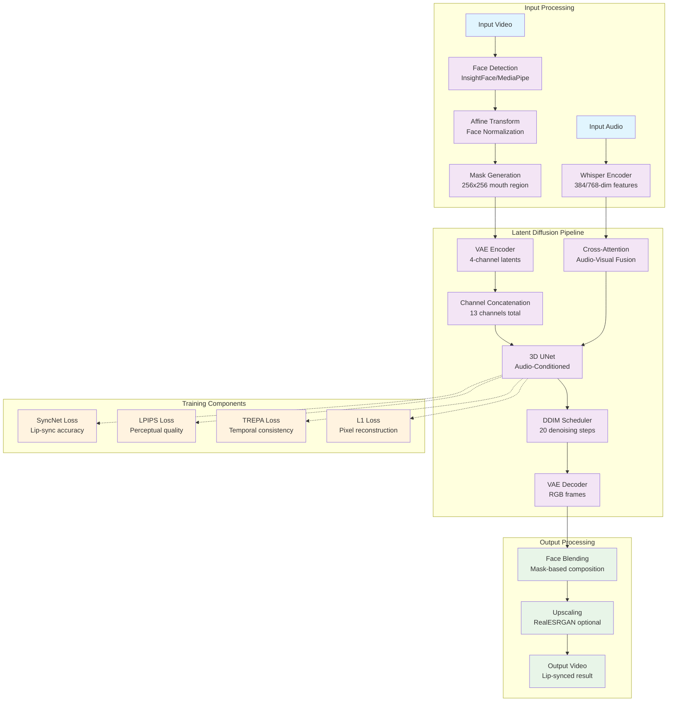
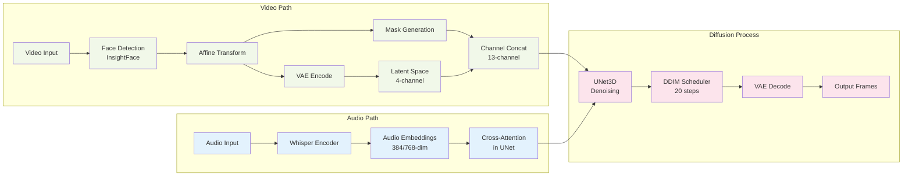
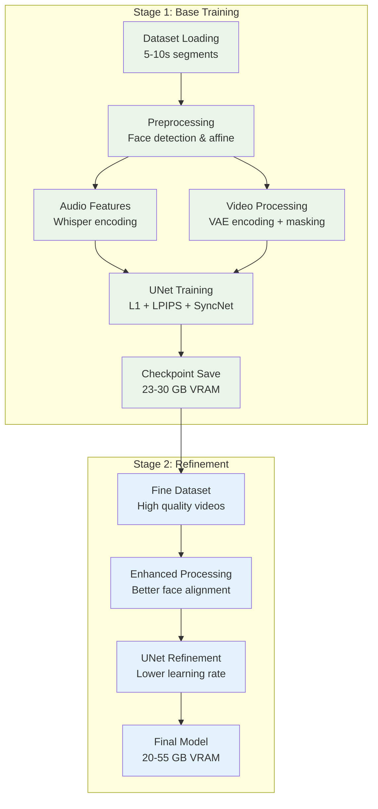
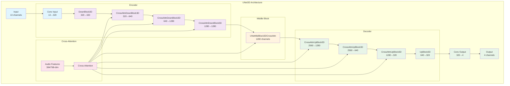

# LatentSync Complete Documentation

<div align="center">

[](https://arxiv.org/abs/2412.09262)
[](https://huggingface.co/ByteDance/LatentSync-1.6)
[](https://huggingface.co/spaces/fffiloni/LatentSync)
<a href="https://replicate.com/lucataco/latentsync"></a>

</div>

---

## Table of Contents

1. [🚀 Quick Start](#-quick-start)
2. [🏗️ System Architecture](#️-system-architecture)
3. [📦 Installation & Setup](#-installation--setup)
4. [💻 Usage](#-usage)
5. [🏋️ Training](#️-training)
6. [📊 Evaluation](#-evaluation)
7. [🔧 Technical Details](#-technical-details)
8. [🚢 Deployment](#-deployment)
9. [📈 Version History](#-version-history)
10. [🔗 References](#-references)

---

## 🚀 Quick Start

### What is LatentSync?

LatentSync is an end-to-end lip-sync method based on audio-conditioned latent diffusion models. Unlike previous methods that use pixel-space diffusion or two-stage generation, LatentSync operates directly in latent space without intermediate motion representations, leveraging Stable Diffusion's powerful capabilities.

### Quick Setup

```bash
# 1. Setup environment
source setup_env.sh

# 2. Launch web interface
python gradio_app.py

# 3. Or use command line
./inference.sh
```

### System Requirements

| Version | Resolution | VRAM (Training) | VRAM (Inference) |
|---------|------------|-----------------|-------------------|
| LatentSync 1.5 | 256×256 | 20-30 GB | 8 GB |
| LatentSync 1.6 | 512×512 | 30-55 GB | 18 GB |

---

## 🏗️ System Architecture

### Core Pipeline



### Data Flow



### Project Structure

```mermaid
graph TB
    ROOT[LatentSync/] --> CORE[latentsync/<br/>Core Library]
    ROOT --> CONFIGS[configs/<br/>Configuration Files]
    ROOT --> SCRIPTS[scripts/<br/>Training & Inference]
    ROOT --> PREPROCESS[preprocess/<br/>Data Preparation]
    ROOT --> EVAL[eval/<br/>Evaluation Tools]
    ROOT --> RIFE[ECCV2022-RIFE/<br/>Frame Interpolation]
    
    CORE --> DATA[data/<br/>Dataset Loaders]
    CORE --> MODELS[models/<br/>Neural Networks]
    CORE --> PIPELINES[pipelines/<br/>Inference Logic]
    CORE --> UTILS[utils/<br/>Helper Functions]
    CORE --> WHISPER[whisper/<br/>Audio Processing]
    CORE --> TREPA[trepa/<br/>Loss Functions]
    
    CONFIGS --> AUDIO_CFG[audio.yaml]
    CONFIGS --> UNET_CFG[unet/*.yaml]
    CONFIGS --> SYNC_CFG[syncnet/*.yaml]
    
    classDef core fill:#e3f2fd
    classDef config fill:#f1f8e9
    classDef script fill:#fce4ec
    classDef tool fill:#fff8e1
    
    class CORE,DATA,MODELS,PIPELINES,UTILS,WHISPER,TREPA core
    class CONFIGS,AUDIO_CFG,UNET_CFG,SYNC_CFG config  
    class SCRIPTS,PREPROCESS,EVAL script
    class RIFE tool
```

---

## 📦 Installation & Setup

### Environment Setup

```bash
# Clone repository
git clone https://github.com/ByteDance/LatentSync.git
cd LatentSync

# Setup environment (installs dependencies and downloads models)
source setup_env.sh
```

### Manual Installation

```bash
# Create conda environment
conda create -n latentsync python=3.8
conda activate latentsync

# Install dependencies
pip install -r requirements.txt

# Download models manually
huggingface-cli download ByteDance/LatentSync-1.6 latentsync_unet.pt --local-dir checkpoints
huggingface-cli download ByteDance/LatentSync-1.6 whisper/tiny.pt --local-dir checkpoints
```

### Verification

After setup, verify your installation:

```bash
# Check model files
ls checkpoints/
# Should show: latentsync_unet.pt, whisper/tiny.pt

# Test inference
python scripts/inference.py --help
```

---

## 💻 Usage

### Web Interface (Recommended)

```bash
python gradio_app.py
```

Then navigate to `http://localhost:7860` in your browser.

### Command Line Interface

```bash
# Basic usage
python scripts/inference.py \
  --video_path /path/to/video.mp4 \
  --audio_path /path/to/audio.wav \
  --output_path /path/to/result.mp4

# With custom parameters
python scripts/inference.py \
  --video_path input.mp4 \
  --audio_path audio.wav \
  --output_path result.mp4 \
  --inference_steps 30 \
  --guidance_scale 2.5
```

### Parameter Tuning

| Parameter | Range | Default | Effect |
|-----------|-------|---------|--------|
| `inference_steps` | 10-50 | 20 | Higher → better quality, slower |
| `guidance_scale` | 1.0-3.0 | 1.5 | Higher → better sync, may cause artifacts |
| `batch_size` | 1-4 | 1 | Higher → faster (if VRAM allows) |

---

## 🏋️ Training

### Data Preparation

The complete data processing pipeline:

```mermaid
flowchart TD
    subgraph "Preprocessing Steps"
        RAW[Raw Video Dataset] --> BROKEN[Remove Broken Videos<br/>Check file integrity]
        BROKEN --> RESAMPLE[Resample FPS & Audio<br/>25fps, 16kHz audio]
        RESAMPLE --> SCENE[Scene Detection<br/>PySceneDetect]
        SCENE --> SEGMENT[Segment Videos<br/>5-10 second clips]
        SEGMENT --> AFFINE[Affine Transform<br/>InsightFace landmarks]
        AFFINE --> SYNC_FILTER[Sync Confidence Filter<br/>SyncNet score > 3.0]
        SYNC_FILTER --> QUALITY[Visual Quality Filter<br/>hyperIQA score > 40]
        QUALITY --> FINAL[High Quality Dataset<br/>Ready for training]
    end
    
    classDef processing fill:#f3e5f5
    classDef output fill:#e8f5e8
    
    class RAW,BROKEN,RESAMPLE,SCENE,SEGMENT,AFFINE,SYNC_FILTER,QUALITY processing
    class FINAL output
```



```bash
# Run data processing pipeline
./data_processing_pipeline.sh

# Generate training file lists
python -m tools.write_fileslist
```

### Training Pipeline



### Training Commands

```bash
# Stage 1 Training (23-30GB VRAM)
./train_unet.sh --config configs/unet/stage1.yaml

# Stage 2 Training (20GB VRAM - efficient)
./train_unet.sh --config configs/unet/stage2_efficient.yaml

# Stage 2 Training (30GB VRAM - optimal quality)
./train_unet.sh --config configs/unet/stage2.yaml

# High resolution training (55GB VRAM)
./train_unet.sh --config configs/unet/stage2_512.yaml
```

### Training Configuration

Available configs in `configs/unet/`:

| Config | Resolution | VRAM | Purpose |
|--------|------------|------|---------|
| `stage1.yaml` | 256×256 | 23GB | Initial training |
| `stage2.yaml` | 256×256 | 30GB | Refinement (best quality) |
| `stage2_efficient.yaml` | 256×256 | 20GB | RTX 3090 compatible |
| `stage1_512.yaml` | 512×512 | 30GB | High-res initial |
| `stage2_512.yaml` | 512×512 | 55GB | High-res refinement |

### SyncNet Training

```bash
# Download pretrained SyncNet
huggingface-cli download ByteDance/LatentSync-1.6 stable_syncnet.pt --local-dir checkpoints

# Train custom SyncNet
./train_syncnet.sh
```

---

## 📊 Evaluation

### Sync Confidence Evaluation

```bash
# Evaluate sync confidence score
./eval/eval_sync_conf.sh --video_path generated_video.mp4

# Batch evaluation
./eval/eval_sync_conf.sh --input_dir /path/to/videos/
```

### SyncNet Accuracy Testing

```bash
# Test SyncNet accuracy on dataset
./eval/eval_syncnet_acc.sh --dataset_path /path/to/test_data/
```

### Quality Metrics

The system uses multiple evaluation metrics:

- **Sync Confidence**: Lip-sync quality (higher is better, >3.0 good)
- **LPIPS**: Perceptual image quality (lower is better)
- **hyperIQA**: Visual quality assessment (>40 good)
- **TREPA**: Temporal consistency (lower is better)

---

## 🔧 Technical Details

### Model Architecture

The UNet3D architecture with detailed channel information:



### Performance Characteristics

| Component | Performance | Bottleneck | Optimization |
|-----------|-------------|------------|--------------|
| Face Detection | CPU-bound | Sequential processing | Parallel processing |
| Audio Processing | Fast | Whisper model size | Model caching |
| UNet Inference | GPU-bound | Memory bandwidth | Mixed precision |
| Video I/O | I/O-bound | Disk speed | In-memory processing |

### Optimization Opportunities

**High Impact (Easy Implementation)**:
- Add `torch.compile()` for 20-30% speedup
- Implement batched inference for video chunks
- Enable mixed precision (FP16) training/inference
- Use efficient attention mechanisms (FlashAttention-2)

**Medium Impact**:
- Parallel face detection using multiprocessing
- In-memory video processing (avoid disk I/O)
- Model quantization (INT8/FP8) for deployment
- Temporal consistency improvements

**Experimental**:
- Progressive resolution training
- Latent consistency models for fewer steps
- ControlNet integration for better face control
- Real-time inference optimizations

---

## 🚢 Deployment

### Docker Deployment

#### Main Application

```bash
# Build and run main app
docker build -t latentsync-app .
docker run -p 8000:8000 latentsync-app

# With authentication
docker run -e AUTH_USERNAME=admin -e AUTH_PASSWORD=secure123 -p 8000:8000 latentsync-app
```

#### RIFE Frame Interpolation

```bash
# Build and run RIFE app
cd ECCV2022-RIFE
docker build -t rife-app .
docker run -p 7860:7860 rife-app
```

### Docker Compose

```yaml
version: '3.8'
services:
  latentsync:
    build: .
    ports:
      - "8000:8000"
    environment:
      - AUTH_USERNAME=${AUTH_USERNAME:-}  # Optional authentication
      - AUTH_PASSWORD=${AUTH_PASSWORD:-}
    volumes:
      - ./results:/app/results
      - ./checkpoints:/app/checkpoints

  rife:
    build: ./ECCV2022-RIFE
    ports:
      - "7860:7860"
    environment:
      - AUTH_USERNAME=${AUTH_USERNAME:-}
      - AUTH_PASSWORD=${AUTH_PASSWORD:-}
    volumes:
      - ./temp_gradio:/app/temp_gradio
```

### Cloud Deployment

#### Platform Configuration

| Platform | Environment Variables | Notes |
|----------|----------------------|--------|
| **Coolify** | Set `AUTH_USERNAME`, `AUTH_PASSWORD` | Supports Docker deployment |
| **Railway** | Set env vars in dashboard | GPU support limited |
| **Render** | Configure in settings | CPU-only instances |
| **AWS ECS** | Use task definitions | GPU instances recommended |
| **Google Cloud Run** | Limited by memory/time | Consider GPU SKUs |

#### Security Considerations

- **Authentication**: Always enable in production with strong passwords
- **HTTPS**: Use reverse proxy (nginx, Traefik) for SSL termination
- **Resource Limits**: Set memory/CPU limits to prevent abuse
- **Network Security**: Restrict access to necessary ports only

### FFmpeg Encoding Standards

All video output uses standardized encoding:

```bash
ffmpeg -i input.mp4 \
  -c:v libx264 -preset slow -crf 18 \
  -pix_fmt yuv420p \
  -vf "format=yuv420p,colorspace=all=bt709:iall=bt709:fast=1" \
  -color_primaries bt709 -color_trc bt709 -colorspace bt709 \
  -movflags +faststart \
  -c:a aac -b:a 192k -ar 16000 \
  output.mp4
```

---

## 📈 Version History

### LatentSync 1.6 (Latest)
*Released: June 11, 2025*

**Key Improvements:**
- **Higher Resolution**: Trained on 512×512 videos to reduce blurriness
- **Better Quality**: Significantly improved visual sharpness and detail
- **Hardware Requirements**: 18GB VRAM for inference, 55GB for training

**Technical Changes:**
- No model architecture changes - only dataset resolution upgrade
- Compatible with existing code - just load different checkpoint
- Backward compatible with 1.5 configurations

### LatentSync 1.5
*Released: March 14, 2025*

**Major Features:**
- **Temporal Consistency**: Added temporal layer for improved frame coherence
- **Chinese Language Support**: Enhanced performance on Chinese videos
- **Memory Optimization**: Reduced Stage 2 training to 20GB VRAM
- **RTX 3090 Support**: Consumer GPU training capability

**Optimizations:**
- Gradient checkpointing in UNet, VAE, SyncNet, and VideoMAE
- FlashAttention-2 integration (replaced xFormers)
- CUDA cache management improvements
- Selective fine-tuning (temporal + cross-attention layers only)

**Code Improvements:**
- Removed xFormers and Triton dependencies
- Upgraded to Diffusers 0.32.2
- Improved training stability

### LatentSync 1.0
*Initial Release*

- Basic latent diffusion lip-sync implementation
- 256×256 resolution training and inference
- Full parameter training approach
- Higher VRAM requirements

---

## 🔗 References

### Academic Resources
- **Paper**: [LatentSync: Taming Audio-Conditioned Latent Diffusion Models](https://arxiv.org/abs/2412.09262)
- **Citation**:
  ```bibtex
  @article{li2024latentsync,
    title={LatentSync: Taming Audio-Conditioned Latent Diffusion Models for Lip Sync with SyncNet Supervision},
    author={Li, Chunyu and Zhang, Chao and Xu, Weikai and Lin, Jingyu and Xie, Jinghui and Feng, Weiguo and Peng, Bingyue and Chen, Cunjian and Xing, Weiwei},
    journal={arXiv preprint arXiv:2412.09262},
    year={2024}
  }
  ```

### Online Resources
- **Models**: [HuggingFace Repository](https://huggingface.co/ByteDance/LatentSync-1.6)
- **Demo**: [HuggingFace Space](https://huggingface.co/spaces/fffiloni/LatentSync)
- **API**: [Replicate](https://replicate.com/lucataco/latentsync)

### Acknowledgments
Built upon excellent open-source projects:
- [AnimateDiff](https://github.com/guoyww/AnimateDiff) - Base diffusion architecture
- [MuseTalk](https://github.com/TMElyralab/MuseTalk) - Audio-visual processing
- [StyleSync](https://github.com/guanjz20/StyleSync) - Lip-sync techniques
- [SyncNet](https://github.com/joonson/syncnet_python) - Sync evaluation
- [Wav2Lip](https://github.com/Rudrabha/Wav2Lip) - Baseline comparisons
- [RIFE](https://github.com/megvii-research/ECCV2022-RIFE) - Frame interpolation

### Additional Components
- **Whisper**: Audio feature extraction
- **InsightFace**: Face detection and alignment
- **RealESRGAN**: Video upscaling
- **PySceneDetect**: Scene boundary detection

---

*This comprehensive documentation consolidates all LatentSync information with enhanced Mermaid diagrams for better understanding. For the latest updates, visit the [GitHub repository](https://github.com/ByteDance/LatentSync).*