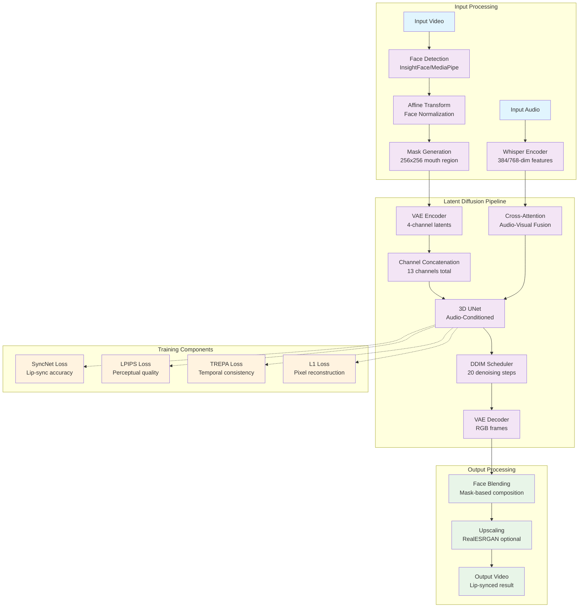
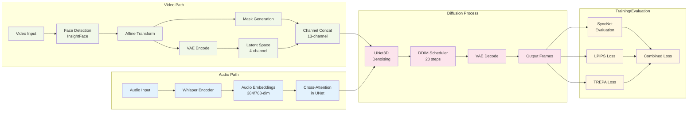
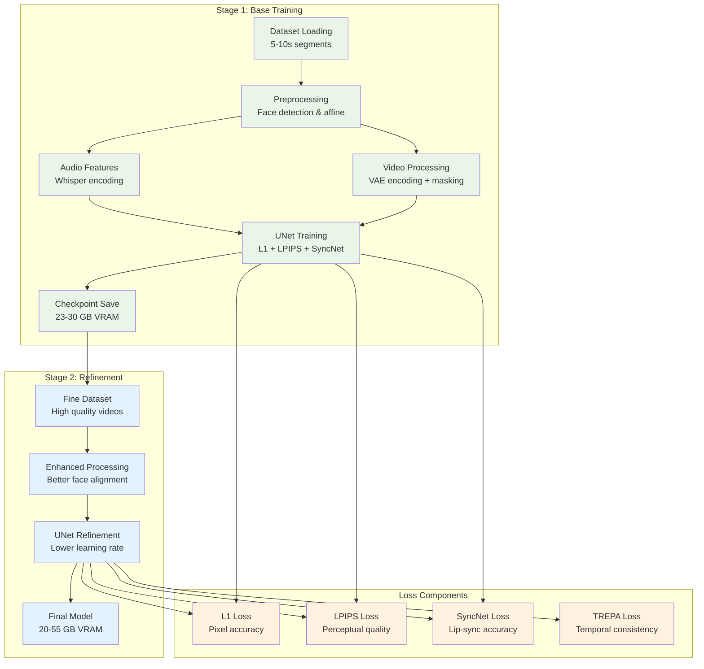
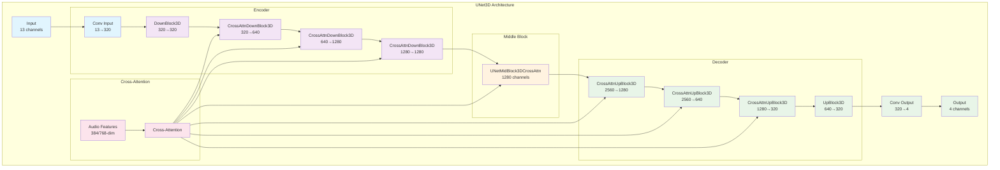
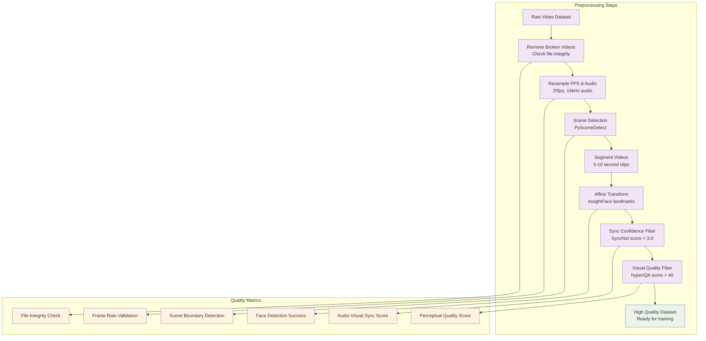

# LatentSync Project Documentation

## 1. ARCHITECTURE OVERVIEW

### System Architecture
- **Purpose**: Real-time lip-sync video generation using audio-conditioned latent diffusion models
- **Core Approach**: End-to-end latent space diffusion with direct audio conditioning via Whisper embeddings
- **Key Technologies**: PyTorch, Diffusers, Stable Diffusion, Whisper, VAE, DDIM, InsightFace, MediaPipe
- **Innovation**: First method to use latent diffusion for lip-sync without intermediate motion representation

### System Architecture Diagram



### Data Flow Overview
The system processes input video and audio through a sophisticated pipeline that maintains temporal consistency while achieving high-quality lip synchronization through latent space diffusion.

### Major Components
- **UNet3D**: Core diffusion model with audio conditioning - `latentsync/models/unet.py`
- **SyncNet**: Lip-sync quality discriminator - `latentsync/models/stable_syncnet.py`
- **Audio Processing**: Whisper-based feature extraction - `latentsync/whisper/`
- **Video Pipeline**: End-to-end inference system - `latentsync/pipelines/lipsync_pipeline.py`
- **Training System**: Multi-stage training with various losses - `scripts/train_unet.py`

## 2. COMPONENT MAP

### Component Dependencies Diagram



### Entry Points
- **Gradio Interface**: `gradio_app.py:1` - Web UI for easy access
- **CLI Inference**: `scripts/inference.py:1` - Command-line interface
- **Training**: `scripts/train_unet.py:1` - UNet training entry
- **Prediction API**: `predict.py:1` - Cog deployment interface

### Configuration System
- **Audio Config**: `configs/audio.yaml` - Sample rates, mel specs, window sizes
- **UNet Configs**: `configs/unet/*.yaml` - Model architecture and training settings
- **SyncNet Configs**: `configs/syncnet/*.yaml` - Discriminator configurations
- **Scheduler**: `configs/scheduler_config.json` - DDIM inference settings

## 3. KEY PATTERNS

### Training Pipeline Diagram



### Model Architecture Details



### Data Processing Pipeline



### Code Patterns
- **Config Loading**: YAML-based with OmegaConf - Example: `scripts/train_unet.py`
- **Model Checkpointing**: State dict with optimizer states - Example: `scripts/train_unet.py`
- **Batch Processing**: 16-frame chunks with overlap - Example: `latentsync/pipelines/lipsync_pipeline.py`
- **Loss Combination**: Multi-objective with weights - Example: `scripts/train_unet.py`

### Common Abstractions
- **AudioEncoder**: Whisper wrapper for consistent audio features
- **FaceDetector**: Unified interface for face detection/tracking
- **VideoReader/Writer**: Abstraction over video I/O operations
- **ImageProcessor**: Face alignment and mask generation utilities

### Anti-patterns to Avoid
- Don't process video all at once - use chunking for memory efficiency
- Don't use pixel-space diffusion - stay in latent space
- Don't ignore temporal consistency - use overlapping chunks
- Don't hardcode paths - use config files

## 4. NAVIGATION GUIDE

### Quick Find
- **Main Pipeline**: `latentsync/pipelines/lipsync_pipeline.py:48` - LipsyncPipeline class
- **UNet Model**: `latentsync/models/unet.py:39` - UNet3DConditionModel
- **Audio Processing**: `latentsync/whisper/audio2feature.py:1` - Audio feature extraction
- **Face Detection**: `latentsync/utils/face_detector.py:1` - Multi-backend face detection
- **Training Script**: `scripts/train_unet.py:1` - Main training loop
- **Inference Script**: `scripts/inference.py:1` - Command-line inference

### Directory Structure Diagram

```mermaid
graph TB
    ROOT[LatentSync/] --> CORE[latentsync/<br/>Core Library]
    ROOT --> CONFIGS[configs/<br/>Configuration Files]
    ROOT --> SCRIPTS[scripts/<br/>Training & Inference]
    ROOT --> PREPROCESS[preprocess/<br/>Data Preparation]
    ROOT --> EVAL[eval/<br/>Evaluation Tools]
    ROOT --> TOOLS[tools/<br/>Utilities]
    
    CORE --> DATA[data/<br/>Dataset Loaders]
    CORE --> MODELS[models/<br/>Neural Networks]
    CORE --> PIPELINES[pipelines/<br/>Inference Logic]
    CORE --> UTILS[utils/<br/>Helper Functions]
    CORE --> WHISPER[whisper/<br/>Audio Processing]
    CORE --> TREPA[trepa/<br/>Loss Functions]
    
    CONFIGS --> AUDIO_CFG[audio.yaml]
    CONFIGS --> UNET_CFG[unet/*.yaml]
    CONFIGS --> SYNC_CFG[syncnet/*.yaml]
    
    SCRIPTS --> TRAIN[train_unet.py]
    SCRIPTS --> INFER[inference.py]
    SCRIPTS --> TRAIN_SYNC[train_syncnet.py]
    
    classDef core fill:#e3f2fd
    classDef config fill:#f1f8e9
    classDef script fill:#fce4ec
    classDef tool fill:#fff8e1
    
    class CORE,DATA,MODELS,PIPELINES,UTILS,WHISPER,TREPA core
    class CONFIGS,AUDIO_CFG,UNET_CFG,SYNC_CFG config  
    class SCRIPTS,TRAIN,INFER,TRAIN_SYNC script
    class PREPROCESS,EVAL,TOOLS tool
```

### Directory Purposes
- `/latentsync`: Core library implementation
  - `/data`: Dataset loaders for training (SyncNet & UNet datasets)
  - `/models`: Neural network architectures (UNet3D, SyncNet, attention modules)
  - `/pipelines`: Inference pipelines (LipsyncPipeline)
  - `/utils`: Helper functions (face detection, audio processing, image utilities)
  - `/whisper`: Audio feature extraction using Whisper
  - `/trepa`: Temporal consistency loss functions
- `/configs`: Configuration files for different training stages
- `/scripts`: Training and inference entry points
- `/preprocess`: Data preparation and filtering tools
- `/eval`: Evaluation metrics and benchmarking tools
- `/tools`: Utility scripts for dataset management

## 5. TASK PLAYBOOK

### Common Tasks

#### Adding a new loss function
1. Check existing losses in `scripts/train_unet.py` - search for loss computation
2. Add loss computation in training loop
3. Update loss weights in config files under `configs/unet/`
4. Add loss to tensorboard logging

#### Modifying audio processing
1. Start at `latentsync/whisper/audio2feature.py`
2. Check audio config in `configs/audio.yaml`
3. Update feature dimensions if needed
4. Ensure compatibility with UNet cross-attention

#### Changing video resolution
1. Update VAE configuration in pipeline
2. Modify face detection resolution in `latentsync/utils/face_detector.py`
3. Adjust UNet architecture if needed
4. Update configs for new resolution (stage1_512.yaml, stage2_512.yaml)

#### Debugging inference issues
1. Start at main entry points: `gradio_app.py` or `scripts/inference.py`
2. Check logs in `latentsync/pipelines/lipsync_pipeline.py`
3. Common issues:
   - **OOM**: Reduce batch size, enable gradient checkpointing, use efficient configs
   - **Face detection failure**: Check input video quality, try different detection backends
   - **Audio sync issues**: Verify audio sample rate (16kHz), check Whisper model size
   - **Quality issues**: Adjust guidance_scale (1.0-3.0), increase inference_steps (20-50)

#### Training from scratch
1. Prepare dataset using tools in `preprocess/` directory
2. Run complete data processing pipeline: `./data_processing_pipeline.sh`
3. Create file lists for train/val splits using `tools/write_fileslist.py`
4. Copy and modify config from `configs/unet/` (start with stage1.yaml)
5. Start training: `./train_unet.sh`
6. Monitor progress with tensorboard
7. Switch to stage2 config for refinement training

#### Fine-tuning on custom data
1. Use `fine_tuning.sh` as template
2. Prepare smaller dataset (100-1000 samples)
3. Use lower learning rate (1e-6 to 5e-6)
4. Train for fewer steps (5000-10000)
5. Monitor for overfitting

### Performance Optimization Strategies

#### Memory Optimization
- **Training**: Use gradient checkpointing, mixed precision (FP16), efficient configs
- **Inference**: Reduce batch size to 1, enable CPU offloading for large models
- **Data Loading**: Use smaller resolution configs (256x256 vs 512x512)

#### Speed Optimization  
- **Training**: Enable xformers attention, use compiled models, optimize data loading
- **Inference**: Reduce DDIM steps (10-15), use efficient schedulers, batch processing
- **Deployment**: Use TensorRT for production, quantization for edge devices

#### Quality Enhancement
- **Training**: Use higher resolution configs, increase training steps, better data quality
- **Inference**: Increase guidance scale (2.0-3.0), more denoising steps (30-50)
- **Post-processing**: Enable upscaling with RealESRGAN, better face blending

### Model Deployment Options

#### Docker Deployment
```bash
# Build container
docker build -t latentsync .

# Run with GPU support
docker run --gpus all -p 7860:7860 latentsync
```

#### API Deployment
- **Cog**: Use `predict.py` for Replicate deployment
- **Gradio**: Built-in API endpoints at `/api/v1/`  
- **Custom**: Wrap `LipsyncPipeline` in FastAPI/Flask

#### Batch Processing
```bash
# Process multiple videos
python scripts/inference.py --input_dir /path/to/videos --output_dir /path/to/results
```

## 6. TECHNICAL SPECIFICATIONS

### Model Versions
- **LatentSync 1.5**: 256x256 resolution, temporal consistency improvements, 8GB VRAM minimum
- **LatentSync 1.6**: 512x512 resolution, reduced blurriness, 18GB VRAM minimum

### Hardware Requirements
- **Training**: 20-55GB VRAM, 32GB+ RAM, fast NVMe storage
- **Inference**: 8-18GB VRAM (depending on version), 16GB RAM
- **Batch Processing**: Scale linearly with number of concurrent videos

### Supported Formats
- **Input**: MP4, AVI, MOV (video), WAV, MP3, AAC (audio)
- **Output**: MP4 with H.264 encoding, configurable quality settings
- **Intermediate**: PyTorch tensors, cached embeddings (.pt files)

This documentation provides comprehensive coverage of the LatentSync architecture with detailed Mermaid diagrams for better understanding and navigation of the complex system.